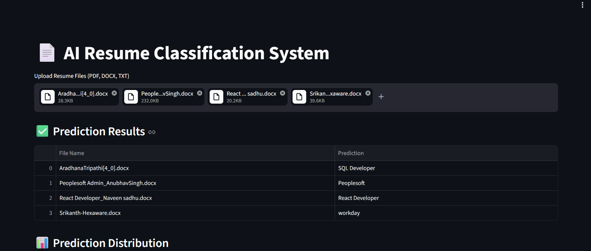
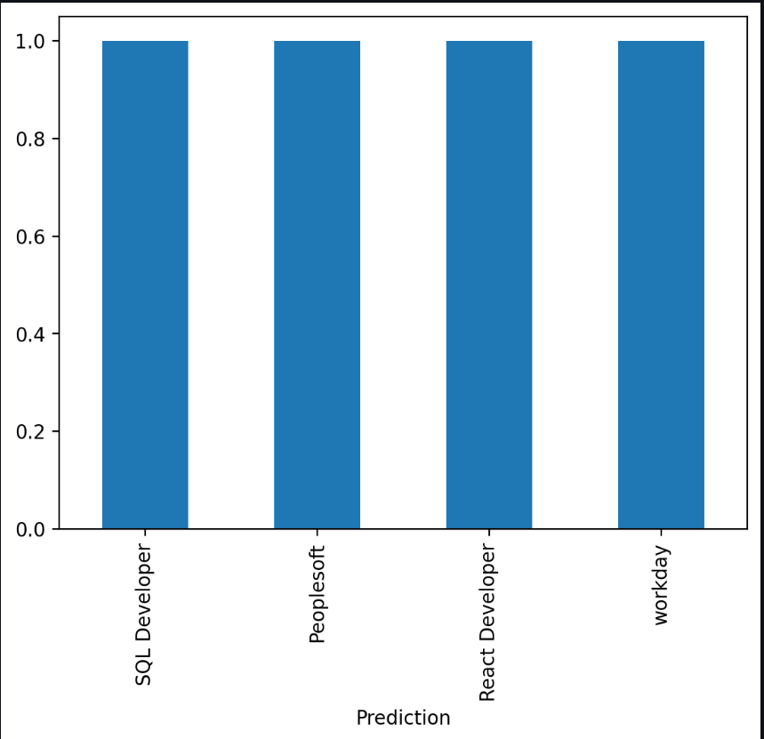
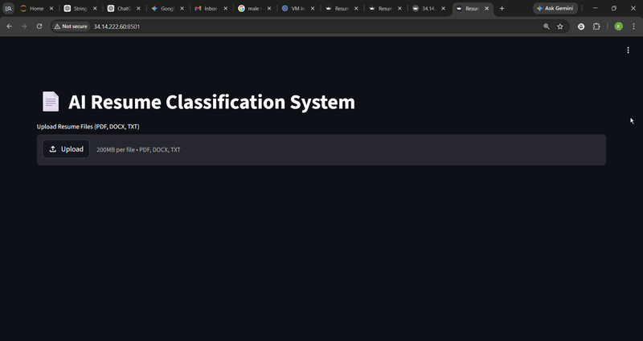

# 📄 AI Resume Classification System (NLP + Cloud Deployment)

🚀 **Live Demo:** http://34.14.222.60:8501

🎯 Automatically classifies resumes into job roles using NLP with real-time predictions via API and an interactive dashboard.

---

## 🔥 Project Highlights

✔ Multi-format resume support (PDF, DOCX, TXT)
✔ Automated text extraction pipeline
✔ NLP preprocessing using spaCy (lemmatization + stopword removal)
✔ TF-IDF feature engineering
✔ Machine Learning classification (Multinomial Naive Bayes)
✔ REST API using FastAPI
✔ Interactive dashboard using Streamlit
✔ Batch prediction support
✔ Data visualization (prediction distribution)
✔ Download results as CSV
✔ Deployed on Google Cloud VM with static IP

---

## 🧠 Problem Statement

Recruiters receive hundreds of resumes for each job role, making manual screening inefficient and time-consuming.

👉 This system automates resume classification using NLP to enable faster and scalable hiring workflows.

💡 This project simulates a real-world HR automation system used in recruitment pipelines.

---

## 🏗️ System Architecture

```
User
 ↓
Streamlit UI
 ↓
FastAPI API
 ↓
NLP Processing
 ↓
ML Model
 ↓
Prediction
```

---

## 🌐 Live Cloud Deployment

🚀 Deployed on Google Cloud Platform (GCP)

### 🔗 Streamlit Dashboard

👉 http://34.14.222.60:8501

### ⚡ FastAPI API Docs

👉 http://34.14.222.60:8000/docs

---

## 🔌 API Example

```bash
curl -X POST "http://34.14.222.60:8000/predict" \
-H "Content-Type: application/json" \
-d '{"resume": "Python developer with machine learning experience"}'
```

👉 Returns predicted job category from the model.

---

## 📈 Model Performance

* Accuracy: ~90% (approximate based on validation)
* Model: Multinomial Naive Bayes
* Feature Engineering: TF-IDF
* NLP: spaCy (lemmatization + stopword removal)

---

## 🚀 Why This Project Stands Out

* End-to-end ML pipeline (data → preprocessing → model → deployment)
* Real-time API + UI integration
* Cloud deployment on GCP with public access
* Handles real-world resume formats
* Production-style system design

---

## ☁️ Deployment Details

* Platform: Google Cloud Platform (GCP VM)
* OS: Linux (Debian)
* Backend: FastAPI (Uvicorn)
* Frontend: Streamlit
* Networking: Static External IP

---

## ▶️ Run on Cloud VM

```bash
source env/bin/activate

uvicorn app.app:app --host 0.0.0.0 --port 8000

streamlit run app/ui.py --server.port 8501 --server.address 0.0.0.0
```

⚠️ Note: If the app is not accessible, the VM instance may be stopped to save cost.

---

## 🧰 Tech Stack

* Python
* Scikit-learn
* spaCy
* FastAPI
* Streamlit
* PyPDF2
* python-docx
* Matplotlib

---

## 📂 Project Structure

```
resume-classification-nlp/
│
├── app/
│   ├── app.py              # FastAPI backend
│   └── ui.py               # Streamlit frontend
│
├── model/
│   ├── resume_model.pkl
│   └── vectorizer.pkl
│
├── data/
├── screenshots/
│
├── requirements.txt
├── README.md
└── .gitignore
```

---

## ⚙️ Local Setup

```bash
git clone https://github.com/Kiran-id10/resume-classification-nlp.git
cd resume-classification-nlp

python3 -m venv env
source env/bin/activate

pip install -r requirements.txt
python3 -m spacy download en_core_web_sm
```

---

## ▶️ Run Locally

```bash
uvicorn app.app:app --reload
streamlit run app/ui.py
```

---

## 📊 Features

* Upload multiple resumes
* View predictions in tabular format
* Visualize prediction distribution
* Download results as CSV

---

## 📸 Dashboard Preview

## 📸 Dashboard Preview

### 🖥️ Main Dashboard


### 📊 Predictions & Visualization


---

## 🎥 Demo



---

## 💡 Key Learnings

* Built a production-ready ML pipeline
* Applied NLP preprocessing for real-world text
* Integrated FastAPI with Streamlit
* Deployed ML system on cloud infrastructure
* Managed real-world deployment challenges

---

## 🎯 Use Cases

* HR automation
* Resume screening
* Talent filtering
* Recruitment analytics

---

## 🔮 Future Improvements

* Add prediction confidence scores
* Dockerize the application
* Improve UI/UX
* Upgrade to deep learning models (BERT)

---

## 👨‍💻 Author

**Kiran Kumar S R**

🎓 Data Science & AI Engineer
💼 Actively seeking Data Science / ML opportunities

---

## ⭐ Support

If you found this project useful, give it a ⭐ on GitHub!

